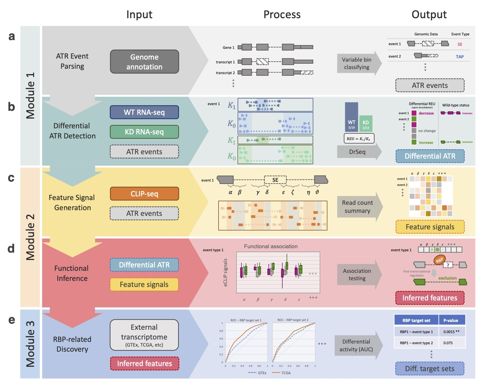
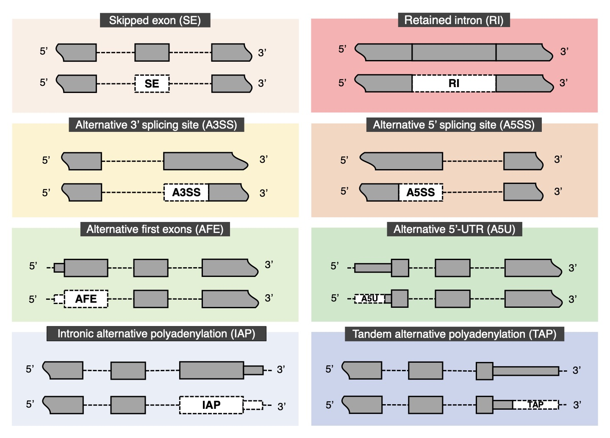
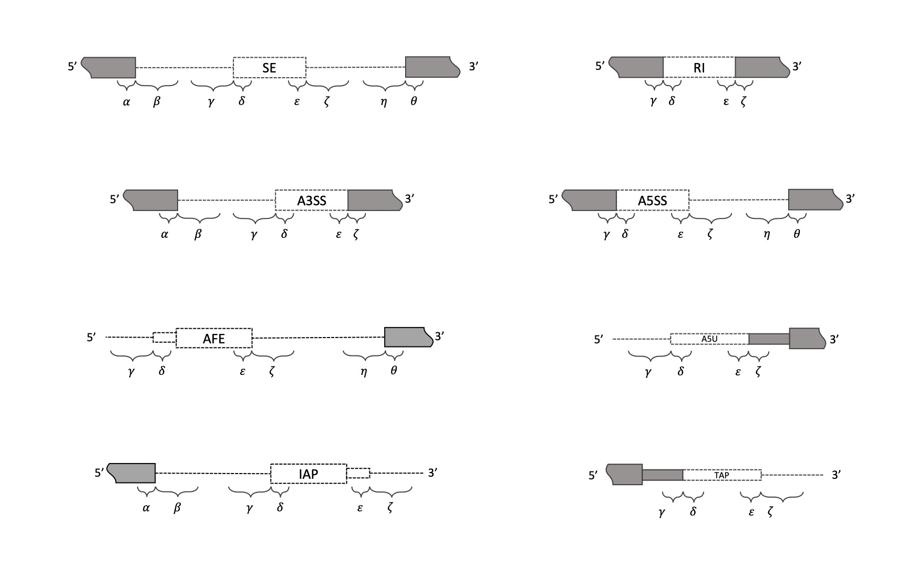
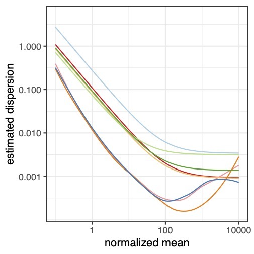
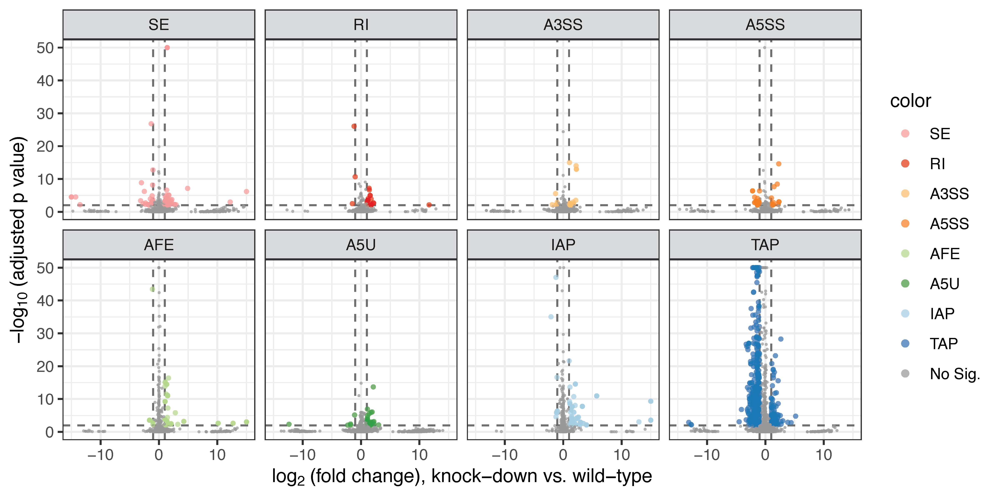

```{r setup, include=FALSE}
knitr::opts_chunk$set(echo = TRUE, 
                      # tidy = TRUE, 
                      tidy.opts = list(comment = FALSE, 
                                       width.cutoff = 60)
                      )
# options(width = 40)
# knitr::opts_knit$set(root.dir = '~/Downloads/surf_vignette')
# knitr::opts_chunk$set(fig.path = "figures/")
library(surf)
```

```{r prepare mm annotation, include=F, eval=F}
library(rtracklayer)
library(usethis)
## parse events from genome annotation (GTF)
## /path/to/genome/annotation/file
anno_file <- "data/gencode.vM23.primary_assembly.annotation.gtf"
anno_mm <- import(anno_file)
gene_id <- anno_mm[seqnames(anno_mm) == "chr14" &
                     anno_mm$gene_type == "protein_coding" &
                     anno_mm$type == "gene"]$gene_id
gene_id_sampled <- sample(unique(gene_id), 50)
anno_mm_select <- anno_mm[anno_mm$gene_id %in% gene_id_sampled]

## Mus musculus
export(anno_mm_select, "data/gencode.vM23.primary.example.gtf")
```

```{r prepare hs annotation, include=F, eval=F}
library(rtracklayer)
library(usethis)
## parse events from genome annotation (GTF)
## /path/to/genome/annotation/file
anno_file <- "data/gencode.v32.primary_assembly.annotation.gtf"
anno_hs <- import(anno_file)
gene_id <- anno_hs[seqnames(anno_hs) == "chr16" &
                     anno_hs$gene_type == "protein_coding" &
                     anno_hs$type == "gene"]$gene_id
gene_id_sampled <- sample(unique(gene_id), 24)
anno_hs_select <- anno_hs[anno_hs$gene_id %in% gene_id_sampled]

## Homo sapiens
export(anno_hs_select, "data/gencode.v32.primary.example.gtf")

## export gene ranges 
genes <- reduce(anno_hs_select)
strand(genes) <- "*"
genes <- resize(genes, width(genes) + 300, fix = "center")
export(genes, "data/gencode.v32.primary.regSURFon.bed")
```

# Overview
This document provides an example of using **SURF** (Version `r packageVersion("surf")`) to integrate CLIP-seq and RNA-seq data for predicting RNA-binding protein (RBP) functions in alternative transcriptional regulation (ATR). 
**SURF** is versatile in and can handle four different tasks centering ATR events:

|  | Data | Format | Task |
| :---: | ------------- | :-------------: | ------------- |
| 1 | genome annotation | any (gtf, gff, ...) | parse ATR events |
| 2 | + RNA-seq | alignment (bam) | detect differential ATR events |
| 3 | + CLIP-seq | alignment (bam) | detect functional association |
| 4 | + external RNA-seq | summarized table | differential transcriptional activity |

To get supports, please submit issues to our [GitHub](https://github.com/fchen365/surf/issues) page. 

```{r pipeline, echo=FALSE, out.width="100%", fig.cap="Schematic overview of SURF pipeline. (a) In the analysis module 1, the first step parses alternative transcriptional regulation (ATR) events from genome annotation. (b) SURF quantifies relative event/exon usage (REU) using RNA-seq data following RBP knockdown (with wild-type control) and performs differential REU analysis (DrSeq). As a result, it infers regulation effects of RBPs as phenotypical labels for each differential ATR event.(c) In the analysis module 2, SURF  extracts location features for each ATR event and generates the feature signals using the complementary eCLIP-seq data. (d) Then, SURF models differential ATR labels by associating them with the feature signals and infers global positional preferences of RBPs. (e) In the discovery module, the inferred location features play a key role in downstream RBP-related discovery. The rank-based analysis of RBP transcript targets using external transcriptome datasets (e.g., TCGA and GTEx) discovers differential transcriptional activity through specific RBP and ATR event types."}

```

# Preparations
To reproduce the results in this vignette, download the demo data from [Zenodo](http://doi.org/10.5281/zenodo.4628573) and put them into a "data" folder under the working directory. 

# Quick start


## One task at a call

The four tasks in the **SURF** pipeline should be streamlined. 
Once you have the data in hand (see the next subsection for how to tell **SURF** about your data), each step can be performed with a single function call:

```{r, eval=F}
library(surf)

event <- parseEvent(anno_file)                                  # step 1
event <- drseq(event, rna_seq_sample)                           # step 2
event <- faseq(event, clip_seq_sample)                          # step 3
event <- daseq(event, getRankings(exprMat), ext_sample)         # step 4
```

Here, `anno_file` (a `charactor(1)`), `rna_seq_sample` (a `data.frame`), `clip_seq_sample` (a `data.frame`), and `ext_sample` (a `data.frame`) describe your data files, and `exprMat` (a `data.frame`) is a summary table of some external transcriptome quantification (e.g., TCGA, GTEx, etc).

## Tell SURF about your data

Describing your data is straightforward.

For task 1, a `character(1)` containing the file path will do.
```{r, eval=F}
anno_file <- "data/gencode.v32.primary.example.gtf"
```

For task 2, **SURF** needs to know where the aligned RNA-seq reads (`bam` files) are and the experimental `condition` for differential analysis (e.g., "knock-down" or "wild-type"). 
```{r, eval=F}
rna_seq_sample <- data.frame(
  row.names = c('sample1', 'sample2', 'sample3', 'sample4'),
  bam = paste0("data/",c("KD1", "KD2", "WT1", "WT2"),".bam"),
  condition = c('knockdown', 'knockdown', 'wildtype', 'wildtype'),
  stringsAsFactors = FALSE
) 
```

Similarly for task 3, **SURF** requires where the alignment files (`bam`) are and the experimental `condition` (e.g., "IP" and the size-match input "SMI"). 
```{r, eval=F}
clip_seq_sample <- data.frame(
  row.names = c('sample5', 'sample6', 'sample7'),
  bam = paste0('data/', c("IP1", "IP2", "SMI"), '.bam'),
  condition = c('IP', 'IP', 'SMI'),
  stringsAsFactors = F
)
```

Finally, for task 4, **SURF** assumes that you have transcriptome quantification summarized in a table (`exprMat`). Each row of the table corresponds to a genomic feature (e.g., genes, transcripts, etc) and each column corresponds to a sample. You can use any your favorite measure (e.g. TPM, RPKM, etc). In addition, it requires a table describing the sample group (`condition`).
```{r, eval=F}
exprMat <- readRDS('data/TcgaTargetGtex_rsem_isoform_tpm_laml_blood_10each.rds')
ext_sample <- data.frame(
  condition = rep(c('TCGA', 'GTEx'), each = 10),
  row.names = colnames(exprMat)
)
```

# The complete SURF workflow
## Step 1: Parse ATR events from genome annotation.

The first step is to parse genome annotation for alternative transcriptional regulation (ATR) events. An ATR event is the exonic region that excluded consecutively in a specific transcript (and is included in some other transcript isoforms from the same gene). There are eight different ATR event types (Figure \@ref(fig:atr)). To parse ATR events, **SURF** provides the `parseEvent()` function. The function compares each transcript to the gene model and extracts the absent exonic regions. These regions are mutually disjoint within the transcript thus can be annotated into specific ATR event types, according to their relative positions within the transcript.

```{r atr, echo=FALSE, out.width="100%", fig.cap="Illustration of eight ATR event types. The eight event types include exon skipping (SE), alternative 3' (A3SS) and 5' (A5SS) splicing, and intron retention (RI) within the AS class; alternative first exon (AFE) and alternative 5'UTR (A5U) within the ATI class; intronic (IAP) and tandem (TAP) alternative polyadenylation within the APA class. In each panel, the upper track depicts part of a gene model, and the lower track demarcates a specific ATR event in a transcript (isoform) with a white dashed box."}

```

The simplest use of `parseEvent()` is to provide the file path of genome annotation. Various types of genome annotation formats are acceptable, such as GTF or GFF.
```{r parse, eval=F}
event <- parseEvent("data/gencode.v32.primary.example.gtf")
```
```{r, echo=F}
# saveRDS(event, "results/intermediate1.rds")
event <- readRDS("results/intermediate1.rds")
```

The function allows several options. For example,

* `cores` specifies the number of computing processors. Since the parsing step is done for individual genes separately, we recommend parallel computing whenever possible. By default, the function will detect the available cores in the current environment (`parallel::detectCores()`), say $n$, and uses $\max (n-2, 1)$ cores. The entire **SURF** workflow uses the same default whenever parallel computing is applicable.
* `min.event.length` allows you to filter the widths (in bp) of ATR events with a lower limit. The default is 6.
* `location.feature` determines whether location features should also be extracted. Location features are the potential locations of protein-RNA interactions within/nearby the specific ATR event. Specifically, they are defined within and flanking the event body and the constitutive (upstream/downstream) exons (Figure \@ref(fig:feature)). The location features is used in Step 3 (to quantify CLIP-seq signals for functional inference) and will not be used by the second step, DrSeq. This may take a considerable amount of computing time. Hence, you could set this option to `FALSE` if you are *only* interested in performing differential regulation of ATR events using RNA-seq (DrSeq). The default is `TRUE`. 
* `depth.exon` and `depth.intron` are relevant only if `location.feature=TRUE`. These options configure the sizes of location features. Specifically, **SURF** uses a fixed length for exonic location features^[In some special cases of short ATR events, the exonic location feature will be shorten so that they do not overlap.] and a fixed length for all intronic location features respectively (Figure \@ref(fig:feature)). The default is `depth.exon=100` and `depth.intron=300`.
* `remove.duplicate` defines whether identical events should be removed. If `remove.duplica=TRUE`, the one event with the highest RNA-seq read coverage will be kept, and the other duplicated events will be removed.
* `verbose` controls whether or not the progress should be printed.  

```{r feature, echo=FALSE, out.width="100%", fig.cap="Illustration of location features for eight ATR event types. White boxes depict the ATR events with the event type labeled inside. Short and long curly brackets correspond to genomic regions of length 100bp and 300bp respectively."}

```

This step outputs a universal `surf` object, which is an extension of `DataFrame` (S4 object). Each ATR event is assigned a unique event identifier (`event_id`) in the form of `<transcript_id>@<event_number>`. The first component, `transcript_id`, is because ATR events are specific to individual transcripts and are mutually disjointed within each transcript. `<event_number>` is numbered from 5' to 3' end of the transcript.
```{r}
event
```

Using the `mcols()` function, we can inspect the description of each column. In particular, the 4th column contains the genomic data of the ATR event (`GenomicRangesList`). The reason that **SURF** uses `GenomicRangesList` instead of `GenomicRanges` is because some ATR events, namely AFE, IAP, and SE if consecutive, may consist of multiple exons. If `location.feature=TRUE`, then `parseEvent()` also outputs the 5th column (also a `GenomicRangesList`) containing the location features. 
```{r}
mcols(event)
```

The output `surf` object also comes with a `genePartsList` slot, for gene parts list. `genePartsList` is a `DataFrame` of 5 columns. Use `genePartsList()` to retrieve the object and `mcols()` to inspect the descriptions of its columns. In particular, the 3rd column (`segment`) contains the smallest pieces (exonic or intronic) in the gene. The 4th column (`label`) indicates whether each segment is exonic or intronic. The 5th column (`layout`) indicates whether each exonic segment is included by individual transcripts of the gene. **SURF** defines the absent exonic regions for each transcript based on these information.
```{r}
pl <- genePartsList(event)
pl
```
```{r}
mcols(pl)
```

Several overlapping operations have been implemented for `surf` object (see Section \@ref(overlap) for details).

## Step 2: Detect differential regulation (DR) of ATR events

```{bash prepare RNA-seq bam files, include=F, eval=F}
## shRNA-seq, target: CPSF6
DIR=rna-seq/bam
KD1=$DIR/ENCSR384BDV/ENCFF291ERF
KD2=$DIR/ENCSR384BDV/ENCFF956SFY
WT1=$DIR/ENCSR424QCW/ENCFF529TIM
WT2=$DIR/ENCSR424QCW/ENCFF361KUQ
# REGION=data/gencode.v32.primary.region.bed
module load python/miniconda
conda activate /workspace/fanchen/conda2
samtools view -b $KD1.sorted.bam chr16 -h chr16 > $KD1.chr16.bam
samtools view -b $KD2.sorted.bam chr16 -h chr16 > $KD2.chr16.bam
samtools view -b $WT1.sorted.bam chr16 -h chr16 > $WT1.chr16.bam
samtools view -b $WT2.sorted.bam chr16 -h chr16 > $WT2.chr16.bam
conda deactivate
```

To detect the differential regulation of ATR events, use `drseq()`. The function requires a table input that specifies the sample information of RNA-seq. The sample data should at least contain a `condition` column indicating the experimental conditions and a `bam` column giving the file directory for the aligned RNA-seq reads. Currently, **SURF** supports "bam" format. If you have read alignments in the "sam" format, we recommend using [samtools](http://quinlanlab.org/tutorials/samtools/samtools.html) (the "view" command) for conversion. 
```{r drseq, eval=F}
rna_seq_sample <- data.frame(
  row.names = c('sample1', 'sample2', 'sample3', 'sample4'),
  bam = paste0("data/",c("KD1", "KD2", "WT1", "WT2"),".bam"),
  condition = c('knockdown', 'knockdown', 'wildtype', 'wildtype'),
  stringsAsFactors = FALSE
) 
event <- drseq(event, rna_seq_sample)
```
```{r, echo=F}
# saveRDS(event, "results/intermediate2.rds")
event <- readRDS("results/intermediate2.rds")
```

The output of `drseq()` (still a `surf` object) contains 6 additional columns (the 7-12th) to the existing output from Step 1. Use `mcols()` to check column descriptions.
```{r}
mcols(event)[7:12,]
event[,7:12]
```


In addition to the main `DataFrame`, the output also contains a `drseqResults` slot, which can be simply accessed by the `drseqResults()` function. The descriptions of columns can be fetched with the `mcols()` function. In the DrSeq results, the two most useful columns are `padj` and `logFoldChange`. `padj` is the p-value of differential event/exon usage (DEU), after multiplicity adjustment with the BH procedure. `logFoldChange` is the fold change of "knockdown" versus "wildtype", after the logarithmic transformation with base 2. For example, if `logFoldChange>0`, it means the EU under the knock-down condition is higher than that under the wild-type condition. 
For the visualizations of DrSeq results, see Section \@ref(visdrseq).
```{r}
drr <- drseqResults(event)
mcols(drr)
drr
```


## Step 3: Test the functional association between RBP binding and DR events. 

```{bash prepare CLIP-seq bam files, include=F, eval=F}
## eCLIP-seq, target: CPSF6
DIR=clip-seq/bam
IP1=$DIR/ENCSR532VUB/ENCFF751GZQ
IP2=$DIR/ENCSR532VUB/ENCFF550ZSZ
SMI=$DIR/ENCSR249WNK/ENCFF842FFD
# REGION=data/gencode.v32.primary.region.bed
module load python/miniconda
conda activate /workspace/fanchen/conda2
samtools sort $IP1.bam -o $IP1.sort.bam
samtools index $IP1.sort.bam
samtools view -b $IP1.sort.bam chr16 -h chr16 > $IP1.chr16.bam
samtools sort $IP2.bam -o $IP2.sort.bam
samtools index $IP2.sort.bam
samtools view -b $IP2.sort.bam chr16 -h chr16 > $IP2.chr16.bam
samtools sort $SMI.bam -o $SMI.sort.bam
samtools index $SMI.sort.bam
samtools view -b $SMI.sort.bam chr16 -h chr16 > $SMI.chr16.bam
conda deactivate
```

To detect the differential regulation of ATR events, use `faseq()`. The function requires a `sampleData` table that specifies the sample information of CLIP-seq data. In particular, a `condition` column indicates the experimental conditions is required, as well as a `bam` column giving the file directory of CLIP-seq alignments. Several parameters are available: 

* `min.size` specifies the minimal sample size in order for a functional association test. The default is 100. We recommend to set this parameter greater than 50 for sufficient statistical power. 
* `fdr.cutoff` is the cutoff of adjusted p-values (FDR). The default is 0.05. This parameter is used for inferring functional location features. 
* `signal.cutoff` is the cut-off of CLIP-seq signals. The CLIP-seq signal is normalized CLIP-seq read coverage on location features. The default is 20. This parameter is used for inferring location features. 
```{r, eval=F}
clip_seq_sample = data.frame(
  row.names = c('sample5', 'sample6', 'sample7'),
  bam = paste0("data/",c("IP1", "IP2", "SMI"),".bam"),
  condition = c('IP', 'IP', 'SMI'),
  stringsAsFactors = FALSE
)
event <- faseq(event, clip_seq_sample, 
               min.size = 3, fdr.cutoff = 0.3, signal.cutoff = 2)
```
```{r, echo=F}
# saveRDS(event, "results/intermediate3.rds")
event <- readRDS("results/intermediate3.rds")
```

The output of `faseq()` (still a `surf` object) adds two additional columns (the 13th and 14th) to the existing output from Step 2. 
```{r}
event[,13:14]
```
Again, use `mcols()` to inspect the description of each column.
```{r}
mcols(event)[13:14,]
```

In addition to the main output, the output also contains a `faseqResults` slot (a `DataFrame` object) which can be accessed by the `faseqResults()` function. For column descriptions, use the `mcols()` function. 
```{r}
far <- faseqResults(event)
mcols(far)
far
```

Each (ATR event, location feature) combination is tested twice for its inclusion and exclusion functions if the usable sample size is greater than `min.size`. 
Each row of output corresponds to the result of one test, including test statistic, p-value, etc. 
In particular, the 2nd column (`feature`) indicates one of the eight possible the location features. The names of features each maps to one of the eight Greek letters in Figure \@ref(fig:feature) as follows. 

| feature name | up3 | up2 | up1 | bd1 | bd2 | dn1 | dn2 | dn3 
| :---: | :-------------: | :-------------: | :-------------: | :-------------: | :-------------: | :-------------: | :-------------: | :-------------: |
| location feature | $\alpha$ | $\beta$ | $\gamma$ | $\delta$ | $\varepsilon$ | $\zeta$ | $\eta$ | $\theta$ |

A useful piece of FASeq results is the inferred location features. The SURF-inferred location features are those genomic regions significantly associated with either inclusion or exclusion of the ATR events and abundantly bound by the RBP (in wild-type condition). `inferredFeature()` retrieves these genomic regions and outputs them in a `GenomicRanges` object. The function essentially filters by adjusted p-values (FDR) and CLIP-seq read coverage. These genomic regions are ATR event-specific (thus transcript- and gene-specific), each of which is assigned a unique name in the `<event_id>-<feature_name>` form. 
```{r}
inferredFeature(event)
```
For example, the first SURF-inferred location feature in the output is for the $\delta$ location (`feature_name` column) of a TAP event (`event_name` column). The binding of the RBP here is associated with the *exclusion* (`functional` column) of the ATR event body (in wild-type condition).  

For visualizations of FASeq results, see Section \@ref(visfaseq).


## Step 4: RBP-related discovery using external transcriptome data

`daseq()` performs RBP-related discovery. Specifically, it uses a re-sampling based method to detect differential activity of a set of RBP targets between two experimental conditions. Currently, `daseq()` supports two types of RBP targets---either genes or transcripts. 
From Step 3 (FASeq), `daseq()` extracts the RBP target sets automatically (although the function also allows users to specify their own RBP target sets of interest). 
Besides the output from `faseq()`, `daseq()` requires two additional inputs: (1) a summary table of external transcriptome quantification. Each row represents a genomic feature (gene or transcript), and each column corresponds to one sample. (2)  A `data.table` that describes sample information. In particular, the table *must* contain a column called `condition`,  indicating the experimental conditions. 
Other controlling parameters include:

* `target.type` determines the type of RBP targets. Currently, it could be either "transcript" or "gene." The default is "transcript."
* `targetSets` and `controlSets` are default to `NULL`. These two arguments allow users to specify their own sets of RBP targets of interest and the corresponding control set.
* `n.sample` is the number of times for resampling. The default is 1,000.

```{r, eval=F}
exprMat <- readRDS('data/TcgaTargetGtex_rsem_isoform_tpm_laml_blood_10each.rds')
ext_sample <- data.frame(
  condition = rep(c('TCGA', 'GTEx'), each = 10),
  row.names = colnames(exprMat)
)
event <- daseq(event, getRankings(exprMat), ext_sample, 
               cores = 1, target.type = "transcript")
```

```{r, echo=F}
# saveRDS(event, "results/intermediate4.rds")
event <- readRDS("results/intermediate4.rds")
```


The output of `daseq()` is still a `surf` object. It contains a `daseqResults` slot, which can be accessed by the `daseqResults()` function. For column descriptions, use `mcols()`.
```{r}
dar <- daseqResults(event)
mcols(dar)
dar
```
Each row of output table summarizes the DA testing of one RBP target set. In particular, the 9th column (`stat`) is the test statistic, and the 11th column (`padj`) is the p-value after the multiplicity adjustment with the BH procedure. 

# Visualization

## Visualize DrSeq results {#visdrseq}

For both `surf` and `drseqResults` objects, two visualization methods are available: (1) `plotDispFunc()` which plots the fitted dispersion functions for each ATR event type (Figure \@ref(fig:dispersion)), and (2) `volcano.plot()` which plots the volcano plot for each ATR events stratified by different event types (Figure \@ref(fig:volcano)). 

```{r dispersion, echo=FALSE, out.width="70%", fig.cap="Estimated mean-dispersion functions from DrSeq analysis of RNA-seq datasets (ENCODE) with RBP targets CPSF6. Each line corresponds to an ATR event type from Figure 2."}

```

```{r volcano, echo=FALSE, out.width="110%", fig.cap="Volcano plot (-log10 transformed adjusted p-value versus log2 of fold change) of DrSeq results for CPSF6, stratified by ATR event types. Horizontal dashed line depicts FDR cut-off level of 0.01 and the vertical lines depict log2 fold change of 1 in absolute value."}

```

## Visualize FASeq results {#visfaseq}
Two visualization methods are available. 
In particular, `fa.plot()` generates the functional association (FA) plots. 
This includes box plots (upper panels) of feature signals and the adjusted p-values resulted from the functional association test (lower panels). 
For example, we generate the FA plots for four ATR events: AFE, A5U, IAP, and TAP. 
Since we used a very small subset of genes/transcripts in the example, the statistical power is lower than what they are usually like. 
Despite this, it can still be seen that the binding of the RBP may result in the exclusion of TAP site by binding at either $\gamma$ or $\delta$ location features.
```{r, fig.width=7, fig.height=4, fig.cap="Functional association plot. The upper panels depicts the actual CLIP-seq binding signals on various location features, stratified by the differential event usage (DEU) upon the RBP knock-down (as the results of Step 2 -- DrSeq). The top strips indicate the ATR event type and the number of ATR events in each DEU group are reported in the parenthesis. The lower panels shows the p-values of the functional association test (FAT)."}
fa.plot(event, plot.event = c("AFE", "A5U", "IAP", "TAP"))
```

<!-- # References -->

# Appendix 
## Overlap operations {#overlap}
The methods `subsetByOverlaps()` and `findOverlaps()` have been implemented for the **SURF** object.
```{r}
gr0 <- GRanges(seqnames = Rle("chr16"), 
               IRanges(89710000, width = 10000))
findOverlaps(event, subject = gr0)
```
Subsetting by overlaps is also implemented (`subsetByOverlaps`).
```{r}
subsetByOverlaps(event, ranges = gr0)
```

# Version information
```{r}
sessionInfo()
```

