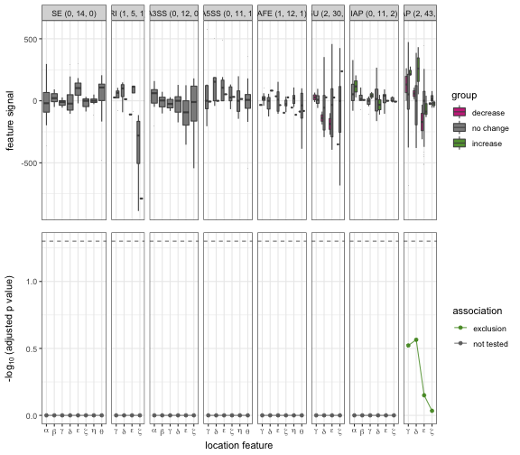

This document provides an example of using `surf` to ananlyze CLIP-seq and RNA-seq for predicting RNA-binding protein functions. `surf` is currently available from [GitHub](https://github.com/fchen365/surf.git). The analysis consists of four steps, which we describe in order. 

## Step 1: parse ATR events from genome annotation.

The first step is to part genome annotation for alternative transcriptional regulation (ATR) events. For this, `surf` provides a `parseEvent` function which takes as input various types of genome annotation files, e.g., GTF or GFF. 

```r
event <- parseEvent("~/Downloads/gencode.v32.primary.example.gtf")
```


The function allows multiple options. 

* `cores` specifies the number of computing processors. 
* `min.event.length` allows you to filter out ATR event by a lower limit of lenght (in bp).
* `location.feature` determines whether location features should also be extracted. This is useful if you are interested in perform differential regulation of ATR event using RNA-seq (DrSeq). The location features will be used to quantify CLIP-seq signals (and will not be used by the second step, DrSeq). 
* `depth.exon` and `depth.intron` is relavent only if `location.feature=TRUE`. The configure the the sizes of location features. 
* `remove.duplicate` defines wehther identical event should be removed. 
* `verbose` controls whether or not the progress should be print out. 

This step outputs a `surf` object. The `surf` object contains a `DataFrame`. 

```r
event
```

```
## surf with 882 rows and 6 columns
##                                    event_id event_name            gene_id
##                                 <character>   <factor>        <character>
## ENST00000163678.11@1   ENST00000163678.11@1        A5U ENSG00000067365.14
## ENST00000163678.11@12 ENST00000163678.11@12        TAP ENSG00000067365.14
## ENST00000163678.11@2   ENST00000163678.11@2        SE  ENSG00000067365.14
## ENST00000163678.11@3   ENST00000163678.11@3        SE  ENSG00000067365.14
## ENST00000381920.7@2     ENST00000381920.7@2        SE  ENSG00000067365.14
## ...                                     ...        ...                ...
## ENST00000576625.5@8     ENST00000576625.5@8       SE   ENSG00000205629.12
## ENST00000576625.5@9     ENST00000576625.5@9       A3SS ENSG00000205629.12
## ENST00000577157.1@1     ENST00000577157.1@1       A5U  ENSG00000205629.12
## ENST00000577157.1@3     ENST00000577157.1@3       SE   ENSG00000205629.12
## ENST00000577157.1@8     ENST00000577157.1@8       IAP  ENSG00000205629.12
##                            transcript_id
##                              <character>
## ENST00000163678.11@1  ENST00000163678.11
## ENST00000163678.11@12 ENST00000163678.11
## ENST00000163678.11@2  ENST00000163678.11
## ENST00000163678.11@3  ENST00000163678.11
## ENST00000381920.7@2    ENST00000381920.7
## ...                                  ...
## ENST00000576625.5@8    ENST00000576625.5
## ENST00000576625.5@9    ENST00000576625.5
## ENST00000577157.1@1    ENST00000577157.1
## ENST00000577157.1@3    ENST00000577157.1
## ENST00000577157.1@8    ENST00000577157.1
##                                                                                             genomicData
##                                                                                           <GRangesList>
## ENST00000163678.11@1                                                            chr16:8621683-8621690:+
## ENST00000163678.11@12                                                           chr16:8646225-8649654:+
## ENST00000163678.11@2                                                            chr16:8623602-8624118:+
## ENST00000163678.11@3                                    chr16:8631247-8632138:+,chr16:8635039-8635079:+
## ENST00000381920.7@2                                                             chr16:8623602-8624118:+
## ...                                                                                                 ...
## ENST00000576625.5@8                                                           chr16:25170714-25170805:+
## ENST00000576625.5@9                                                           chr16:25174746-25174936:+
## ENST00000577157.1@1                                                           chr16:25111731-25111744:+
## ENST00000577157.1@3                                                           chr16:25125964-25126126:+
## ENST00000577157.1@8   chr16:25161102-25161206:+,chr16:25164598-25164718:+,chr16:25169112-25169545:+,...
##                                                                                                 feature
##                                                                                           <GRangesList>
## ENST00000163678.11@1        chr16:8621383-8621682:+,chr16:8621683-8621690:+,chr16:8621683-8621690:+,...
## ENST00000163678.11@12       chr16:8646125-8646224:+,chr16:8646225-8646324:+,chr16:8649555-8649654:+,...
## ENST00000163678.11@2        chr16:8621691-8621775:+,chr16:8621776-8622075:+,chr16:8623302-8623601:+,...
## ENST00000163678.11@3        chr16:8629011-8629110:+,chr16:8629111-8629410:+,chr16:8630947-8631246:+,...
## ENST00000381920.7@2         chr16:8621688-8621775:+,chr16:8621776-8622075:+,chr16:8623302-8623601:+,...
## ...                                                                                                 ...
## ENST00000576625.5@8   chr16:25169114-25169213:+,chr16:25169214-25169513:+,chr16:25170414-25170713:+,...
## ENST00000576625.5@9   chr16:25169114-25169213:+,chr16:25169214-25169513:+,chr16:25174446-25174745:+,...
## ENST00000577157.1@1   chr16:25111431-25111730:+,chr16:25111731-25111744:+,chr16:25111731-25111744:+,...
## ENST00000577157.1@3   chr16:25111745-25111768:+,chr16:25111769-25112068:+,chr16:25125664-25125963:+,...
## ENST00000577157.1@8   chr16:25158832-25158931:+,chr16:25158932-25159231:+,chr16:25160802-25161101:+,...
```

With `mcols()` function, we can inspect the description of each column.

```r
mcols(event)
```

```
## DataFrame with 6 rows and 2 columns
##                      type                          description
##               <character>                          <character>
## event_id       annotation                     event identifier
## event_name     annotation                     event type/class
## gene_id        annotation                gene/group identifier
## transcript_id  annotation     harbouring transcript identifier
## genomicData    annotation      genomic ranges of the ATR event
## feature        annotation genomic ranges of the event features
```

The output `surf` object also comes with a `genePartsList` slot, for gene parts list. `genePartsList` is a `DataFrame` of 5 columns. Use `mcols()` to inspect the descriptions of columns.

```r
pl <- genePartsList(event)
pl
```

```
## DataFrame with 22 rows and 5 columns
##                               gene_id
##                           <character>
## ENSG00000067365.14 ENSG00000067365.14
## ENSG00000075399.14 ENSG00000075399.14
## ENSG00000086504.17 ENSG00000086504.17
## ENSG00000102897.10 ENSG00000102897.10
## ENSG00000102984.15 ENSG00000102984.15
## ...                               ...
## ENSG00000171241.9   ENSG00000171241.9
## ENSG00000174990.7   ENSG00000174990.7
## ENSG00000183751.15 ENSG00000183751.15
## ENSG00000196408.11 ENSG00000196408.11
## ENSG00000205629.12 ENSG00000205629.12
##                                                                 transcript_id
##                                                               <CharacterList>
## ENSG00000067365.14 ENST00000563958.5,ENST00000381920.7,ENST00000163678.11,...
## ENSG00000075399.14  ENST00000561976.5,ENST00000389386.8,ENST00000565023.1,...
## ENSG00000086504.17 ENST00000199706.13,ENST00000648346.1,ENST00000483764.5,...
## ENSG00000102897.10  ENST00000564457.1,ENST00000568663.5,ENST00000412082.6,...
## ENSG00000102984.15 ENST00000568961.5,ENST00000313565.10,ENST00000611294.4,...
## ...                                                                       ...
## ENSG00000171241.9   ENST00000303383.8,ENST00000567698.1,ENST00000563219.1,...
## ENSG00000174990.7   ENST00000649158.1,ENST00000648177.1,ENST00000649794.2,...
## ENSG00000183751.15  ENST00000568546.6,ENST00000561907.5,ENST00000569628.5,...
## ENSG00000196408.11  ENST00000569739.1,ENST00000356120.8,ENST00000354249.8,...
## ENSG00000205629.12  ENST00000380962.9,ENST00000380966.8,ENST00000564011.5,...
##                                                                                              segment
##                                                                                        <GRangesList>
## ENSG00000067365.14       chr16:8621383-8621682:+,chr16:8621683-8621687:+,chr16:8621688-8621690:+,...
## ENSG00000075399.14 chr16:89720899-89721198:-,chr16:89720886-89720898:-,chr16:89720763-89720885:-,...
## ENSG00000086504.17             chr16:371290-371589:-,chr16:371067-371289:-,chr16:370539-371066:-,...
## ENSG00000102897.10 chr16:20899568-20899867:+,chr16:20899868-20899901:+,chr16:20899902-20900004:+,...
## ENSG00000102984.15 chr16:71895337-71895636:-,chr16:71894889-71895336:-,chr16:71884810-71894888:-,...
## ...                                                                                              ...
## ENSG00000171241.9  chr16:46621380-46621679:-,chr16:46621369-46621379:-,chr16:46621352-46621368:-,...
## ENSG00000174990.7  chr16:87936581-87936880:-,chr16:87936561-87936580:-,chr16:87936530-87936560:-,...
## ENSG00000183751.15       chr16:1971753-1972052:+,chr16:1972053-1972070:+,chr16:1972071-1972085:+,...
## ENSG00000196408.11       chr16:1984193-1984492:-,chr16:1984167-1984192:-,chr16:1982752-1984166:-,...
## ENSG00000205629.12 chr16:25111431-25111730:+,chr16:25111731-25111734:+,chr16:25111735-25111741:+,...
##                            label
##                    <NumericList>
## ENSG00000067365.14     0,1,1,...
## ENSG00000075399.14     0,1,1,...
## ENSG00000086504.17     0,1,0,...
## ENSG00000102897.10     0,1,1,...
## ENSG00000102984.15     0,1,0,...
## ...                          ...
## ENSG00000171241.9      0,1,1,...
## ENSG00000174990.7      0,1,1,...
## ENSG00000183751.15     0,1,1,...
## ENSG00000196408.11     0,1,0,...
## ENSG00000205629.12     0,1,1,...
##                                                                                   layout
##                                                                                   <List>
## ENSG00000067365.14    FALSE:FALSE:FALSE:...,TRUE:FALSE:FALSE:...,TRUE:TRUE:FALSE:...,...
## ENSG00000075399.14   FALSE:FALSE:FALSE:...,FALSE:TRUE:FALSE:...,FALSE:TRUE:FALSE:...,...
## ENSG00000086504.17  FALSE:FALSE:FALSE:...,FALSE:TRUE:FALSE:...,FALSE:FALSE:FALSE:...,...
## ENSG00000102897.10    FALSE:FALSE:FALSE:...,TRUE:FALSE:FALSE:...,TRUE:TRUE:FALSE:...,...
## ENSG00000102984.15 FALSE:FALSE:FALSE:...,FALSE:FALSE:FALSE:...,FALSE:FALSE:FALSE:...,...
## ...                                                                                  ...
## ENSG00000171241.9    FALSE:FALSE:FALSE:...,TRUE:FALSE:FALSE:...,TRUE:FALSE:FALSE:...,...
## ENSG00000174990.7      FALSE:FALSE:FALSE:...,TRUE:TRUE:FALSE:...,TRUE:TRUE:FALSE:...,...
## ENSG00000183751.15    FALSE:FALSE:FALSE:...,TRUE:FALSE:FALSE:...,TRUE:TRUE:FALSE:...,...
## ENSG00000196408.11 FALSE:FALSE:FALSE:...,FALSE:FALSE:FALSE:...,FALSE:FALSE:FALSE:...,...
## ENSG00000205629.12     FALSE:FALSE:FALSE:...,TRUE:FALSE:FALSE:...,TRUE:TRUE:TRUE:...,...
```

```r
mcols(pl)
```

```
## DataFrame with 5 rows and 1 column
##                                          description
##                                          <character>
## gene_id                              gene identifier
## transcript_id                 transcript identifiers
## segment                genomic segments (parts list)
## label                   exonic label (0 as intronic)
## layout        transcript (isoform) layout indicators
```

For `surf` object, the useful genomic function, `findOverlaps`, are implemented. 

```r
gr0 <- GRanges(seqnames = Rle("chr16"), IRanges(89710000, width = 10000))
findOverlaps(event, subject = gr0)
```

```
## Hits object with 19 hits and 0 metadata columns:
##        queryHits subjectHits
##        <integer>   <integer>
##    [1]        74           1
##    [2]        76           1
##    [3]        77           1
##    [4]        79           1
##    [5]        80           1
##    ...       ...         ...
##   [15]        92           1
##   [16]        93           1
##   [17]        94           1
##   [18]        95           1
##   [19]        96           1
##   -------
##   queryLength: 882 / subjectLength: 1
```
Subsetting by overlaps is also implemented (`subsetByOverlaps`).

```r
subsetByOverlaps(event, ranges = gr0)
```

```
## surf with 19 rows and 6 columns
##                                event_id event_name            gene_id
##                             <character>   <factor>        <character>
## ENST00000389386.8@1 ENST00000389386.8@1       A3SS ENSG00000075399.14
## ENST00000561976.5@2 ENST00000561976.5@2       A3SS ENSG00000075399.14
## ENST00000561976.5@3 ENST00000561976.5@3       SE   ENSG00000075399.14
## ENST00000563798.1@3 ENST00000563798.1@3       A3SS ENSG00000075399.14
## ENST00000563798.1@4 ENST00000563798.1@4       SE   ENSG00000075399.14
## ...                                 ...        ...                ...
## ENST00000567379.5@4 ENST00000567379.5@4       TAP  ENSG00000075399.14
## ENST00000567379.5@5 ENST00000567379.5@5       IAP  ENSG00000075399.14
## ENST00000568691.5@1 ENST00000568691.5@1       AFE  ENSG00000075399.14
## ENST00000568691.5@2 ENST00000568691.5@2       A3SS ENSG00000075399.14
## ENST00000568691.5@4 ENST00000568691.5@4       TAP  ENSG00000075399.14
##                         transcript_id
##                           <character>
## ENST00000389386.8@1 ENST00000389386.8
## ENST00000561976.5@2 ENST00000561976.5
## ENST00000561976.5@3 ENST00000561976.5
## ENST00000563798.1@3 ENST00000563798.1
## ENST00000563798.1@4 ENST00000563798.1
## ...                               ...
## ENST00000567379.5@4 ENST00000567379.5
## ENST00000567379.5@5 ENST00000567379.5
## ENST00000568691.5@1 ENST00000568691.5
## ENST00000568691.5@2 ENST00000568691.5
## ENST00000568691.5@4 ENST00000568691.5
##                                                                                           genomicData
##                                                                                         <GRangesList>
## ENST00000389386.8@1                                                         chr16:89719103-89719369:-
## ENST00000561976.5@2                                                         chr16:89712717-89713080:-
## ENST00000561976.5@3                                                         chr16:89711599-89711644:-
## ENST00000563798.1@3                                                         chr16:89712717-89713080:-
## ENST00000563798.1@4                                                         chr16:89711599-89711644:-
## ...                                                                                               ...
## ENST00000567379.5@4                                                         chr16:89711327-89711358:-
## ENST00000567379.5@5 chr16:89710586-89711010:-,chr16:89709777-89709909:-,chr16:89709227-89709435:-,...
## ENST00000568691.5@1 chr16:89720763-89720898:-,chr16:89719027-89719369:-,chr16:89716730-89716822:-,...
## ENST00000568691.5@2                                                         chr16:89712094-89712099:-
## ENST00000568691.5@4                                                         chr16:89710586-89710932:-
##                                                                                               feature
##                                                                                         <GRangesList>
## ENST00000389386.8@1 chr16:89720763-89720862:-,chr16:89720463-89720762:-,chr16:89719370-89719669:-,...
## ENST00000561976.5@2 chr16:89716462-89716561:-,chr16:89716162-89716461:-,chr16:89713081-89713380:-,...
## ENST00000561976.5@3 chr16:89711882-89711969:-,chr16:89711582-89711881:-,chr16:89711645-89711881:-,...
## ENST00000563798.1@3 chr16:89720763-89720862:-,chr16:89720463-89720762:-,chr16:89713081-89713380:-,...
## ENST00000563798.1@4 chr16:89711882-89711969:-,chr16:89711582-89711881:-,chr16:89711645-89711881:-,...
## ...                                                                                               ...
## ENST00000567379.5@4 chr16:89711359-89711412:-,chr16:89711327-89711358:-,chr16:89711327-89711358:-,...
## ENST00000567379.5@5 chr16:89711359-89711412:-,chr16:89711059-89711358:-,chr16:89711011-89711310:-,...
## ENST00000568691.5@1 chr16:89720899-89721198:-,chr16:89720799-89720898:-,chr16:89716462-89716561:-,...
## ENST00000568691.5@2 chr16:89712460-89712522:-,chr16:89712160-89712459:-,chr16:89712100-89712399:-,...
## ENST00000568691.5@4 chr16:89710933-89711010:-,chr16:89710833-89710932:-,chr16:89710586-89710685:-,...
```


## Step 2: detect differential regulation (DR) of ATR events


To detect the differnetial regulation of ATR events, use `drseq()` function. The function requires a `sampleData` table that specifies the sample information of RNA-seq. In particular, a `condition` column indicating the experimental conditions is required, as well as a `bam` column giving the file directory for the aligned RNA-seq reads. 

```r
rna_seq_sample <- data.frame(row.names = c("sample1", "sample2", "sample3", "sample4"), 
    bam = paste0("~/Downloads/", c("KD1", "KD2", "WT1", "WT2"), ".bam"), condition = c("knockdown", 
        "knockdown", "wildtype", "wildtype"), stringsAsFactors = FALSE)
event <- drseq(event, rna_seq_sample)
```


The output of `drseq` (still a `surf` object) contains 6 additional columns (the 7-12th) to the existing output from Step 1. 

```r
event[, 7:12]
```

```
## surf with 882 rows and 6 columns
##                       eventBaseMean      padj logFoldChange    adjMean
##                           <numeric> <numeric>     <numeric>  <numeric>
## ENST00000163678.11@1        0.00000        NA            NA 0.00000000
## ENST00000163678.11@12     312.11389  0.054970     0.0916593 0.08844259
## ENST00000163678.11@2        5.50491  0.975509     0.4898729 0.00893654
## ENST00000163678.11@3       55.72381  0.994272     0.1336382 0.05399594
## ENST00000381920.7@2         5.50491  0.975509     0.4898730 0.00893654
## ...                             ...       ...           ...        ...
## ENST00000576625.5@8        97.06122  0.970435    -0.1207714  0.5081739
## ENST00000576625.5@9         4.78001  0.833863    -1.0128452  0.0164828
## ENST00000577157.1@1         5.61396  0.984705    -0.2227436  0.0496810
## ENST00000577157.1@3         7.47223  0.975509    -0.3818396  0.0285200
## ENST00000577157.1@8       328.63720  0.901839    -0.0356011  0.2397062
##                           group  included
##                       <ordered> <logical>
## ENST00000163678.11@1  no change     FALSE
## ENST00000163678.11@12 no change     FALSE
## ENST00000163678.11@2  no change     FALSE
## ENST00000163678.11@3  no change      TRUE
## ENST00000381920.7@2   no change     FALSE
## ...                         ...       ...
## ENST00000576625.5@8   no change      TRUE
## ENST00000576625.5@9   no change     FALSE
## ENST00000577157.1@1   no change     FALSE
## ENST00000577157.1@3   no change     FALSE
## ENST00000577157.1@8   no change     FALSE
```
Again, you can use mcols() to check the description of each columns.

```r
mcols(event)[7:12, ]
```

```
## DataFrame with 6 rows and 2 columns
##                      type
##               <character>
## eventBaseMean       drseq
## padj                drseq
## logFoldChange       drseq
## adjMean           RNA-seq
## group               faseq
## included            faseq
##                                                          description
##                                                          <character>
## eventBaseMean        mean of the counts across samples in each event
## padj                                            BH adjusted p-values
## logFoldChange                        relative exon usage fold change
## adjMean                             adjusted base mean of each event
## group         direction of differential regulation (upon knock-down)
## included                                   indicator of usable event
```

In addition to the main output, the output also contains a `drseqResults` slot, which can be simply accessed by the `drseqResults()` function. 

```r
drr <- drseqResults(event)
drr
```

```
## drseqResults with 882 rows and 15 columns
##                                    event_id event_name            gene_id
##                                 <character>   <factor>        <character>
## ENST00000163678.11@1   ENST00000163678.11@1        A5U ENSG00000067365.14
## ENST00000163678.11@12 ENST00000163678.11@12        TAP ENSG00000067365.14
## ENST00000163678.11@2   ENST00000163678.11@2        SE  ENSG00000067365.14
## ENST00000163678.11@3   ENST00000163678.11@3        SE  ENSG00000067365.14
## ENST00000381920.7@2     ENST00000381920.7@2        SE  ENSG00000067365.14
## ...                                     ...        ...                ...
## ENST00000576625.5@8     ENST00000576625.5@8       SE   ENSG00000205629.12
## ENST00000576625.5@9     ENST00000576625.5@9       A3SS ENSG00000205629.12
## ENST00000577157.1@1     ENST00000577157.1@1       A5U  ENSG00000205629.12
## ENST00000577157.1@3     ENST00000577157.1@3       SE   ENSG00000205629.12
## ENST00000577157.1@8     ENST00000577157.1@8       IAP  ENSG00000205629.12
##                            transcript_id
##                              <character>
## ENST00000163678.11@1  ENST00000163678.11
## ENST00000163678.11@12 ENST00000163678.11
## ENST00000163678.11@2  ENST00000163678.11
## ENST00000163678.11@3  ENST00000163678.11
## ENST00000381920.7@2    ENST00000381920.7
## ...                                  ...
## ENST00000576625.5@8    ENST00000576625.5
## ENST00000576625.5@9    ENST00000576625.5
## ENST00000577157.1@1    ENST00000577157.1
## ENST00000577157.1@3    ENST00000577157.1
## ENST00000577157.1@8    ENST00000577157.1
##                                                                                             genomicData
##                                                                                           <GRangesList>
## ENST00000163678.11@1                                                            chr16:8621683-8621690:+
## ENST00000163678.11@12                                                           chr16:8646225-8649654:+
## ENST00000163678.11@2                                                            chr16:8623602-8624118:+
## ENST00000163678.11@3                                    chr16:8631247-8632138:+,chr16:8635039-8635079:+
## ENST00000381920.7@2                                                             chr16:8623602-8624118:+
## ...                                                                                                 ...
## ENST00000576625.5@8                                                           chr16:25170714-25170805:+
## ENST00000576625.5@9                                                           chr16:25174746-25174936:+
## ENST00000577157.1@1                                                           chr16:25111731-25111744:+
## ENST00000577157.1@3                                                           chr16:25125964-25126126:+
## ENST00000577157.1@8   chr16:25161102-25161206:+,chr16:25164598-25164718:+,chr16:25169112-25169545:+,...
##                                                                                                 feature
##                                                                                           <GRangesList>
## ENST00000163678.11@1        chr16:8621383-8621682:+,chr16:8621683-8621690:+,chr16:8621683-8621690:+,...
## ENST00000163678.11@12       chr16:8646125-8646224:+,chr16:8646225-8646324:+,chr16:8649555-8649654:+,...
## ENST00000163678.11@2        chr16:8621691-8621775:+,chr16:8621776-8622075:+,chr16:8623302-8623601:+,...
## ENST00000163678.11@3        chr16:8629011-8629110:+,chr16:8629111-8629410:+,chr16:8630947-8631246:+,...
## ENST00000381920.7@2         chr16:8621688-8621775:+,chr16:8621776-8622075:+,chr16:8623302-8623601:+,...
## ...                                                                                                 ...
## ENST00000576625.5@8   chr16:25169114-25169213:+,chr16:25169214-25169513:+,chr16:25170414-25170713:+,...
## ENST00000576625.5@9   chr16:25169114-25169213:+,chr16:25169214-25169513:+,chr16:25174446-25174745:+,...
## ENST00000577157.1@1   chr16:25111431-25111730:+,chr16:25111731-25111744:+,chr16:25111731-25111744:+,...
## ENST00000577157.1@3   chr16:25111745-25111768:+,chr16:25111769-25112068:+,chr16:25125664-25125963:+,...
## ENST00000577157.1@8   chr16:25158832-25158931:+,chr16:25158932-25159231:+,chr16:25160802-25161101:+,...
##                       eventBaseMean dispersion      stat     pvalue      padj
##                           <numeric>  <numeric> <numeric>  <numeric> <numeric>
## ENST00000163678.11@1        0.00000         NA        NA         NA        NA
## ENST00000163678.11@12     312.11389 0.00100486 9.1872298 0.00243709  0.054970
## ENST00000163678.11@2        5.50491 0.02949847 0.2557281 0.61307033  0.975509
## ENST00000163678.11@3       55.72381 0.01953954 0.0112228 0.91563191  0.994272
## ENST00000381920.7@2         5.50491 0.02949847 0.2557281 0.61307033  0.975509
## ...                             ...        ...       ...        ...       ...
## ENST00000576625.5@8        97.06122  0.0127761  0.375216   0.540175  0.970435
## ENST00000576625.5@9         4.78001  0.2634898  1.226814   0.268027  0.833863
## ENST00000577157.1@1         5.61396  0.0331676  0.148010   0.700445  0.984705
## ENST00000577157.1@3         7.47223  0.0788642  0.321010   0.571001  0.975509
## ENST00000577157.1@8       328.63720  0.0116675  0.623002   0.429934  0.901839
##                       knockdown  wildtype logFoldChange       countData
##                       <numeric> <numeric>     <numeric>        <matrix>
## ENST00000163678.11@1         NA        NA            NA       0:0:0:...
## ENST00000163678.11@12  23.57588  24.29237     0.0916593 314:406:242:...
## ENST00000163678.11@2    3.12186   3.69866     0.4898729       6:6:4:...
## ENST00000163678.11@3   10.56838  11.06236     0.1336382    58:82:30:...
## ENST00000381920.7@2     3.12186   3.69866     0.4898730       6:6:4:...
## ...                         ...       ...           ...             ...
## ENST00000576625.5@8    14.48334  13.90318    -0.1207714  124:138:84:...
## ENST00000576625.5@9     3.85856   2.72218    -1.0128452      10:6:4:...
## ENST00000577157.1@1     3.90010   3.61244    -0.2227436      6:10:4:...
## ENST00000577157.1@3     4.21989   3.69773    -0.3818396      8:14:2:...
## ENST00000577157.1@8    18.14958  17.95783    -0.0356011 378:490:260:...
```
The descriptions of columns can be found by the `mcols()` function:

```r
mcols(drr)
```

```
## DataFrame with 15 rows and 2 columns
##                      type
##               <character>
## event_id       annotation
## event_name     annotation
## gene_id        annotation
## transcript_id  annotation
## genomicData    annotation
## ...                   ...
## padj                drseq
## knockdown           drseq
## wildtype            drseq
## logFoldChange       drseq
## countData         RNA-seq
##                                                                description
##                                                                <character>
## event_id                                                  event identifier
## event_name                                                event type/class
## gene_id                                              gene/group identifier
## transcript_id                             harbouring transcript identifier
## genomicData                                genomic ranges of the ATR event
## ...                                                                    ...
## padj                                                  BH adjusted p-values
## knockdown                                           exon usage coefficient
## wildtype                                            exon usage coefficient
## logFoldChange                              relative exon usage fold change
## countData     matrix of integer counts, of each column containing a sample
```

For both `surf` and `drseqResults`, two visualization methods are available: (1) `plotDispFunc()` which plots the fitted dispersion functions for each ATR event type, and (2) `volcano.plot()` which plots the volcano plot for each ATR events stratified by different event types. 


## Step 3: test the functional association between RBP binding and DR events. 


To detect the differnetial regulation of ATR events, use `faseq()` function. The function requires a `sampleData` table that specifies the sample information of CLIP-seq. In particular, a `condition` column indicating the experimental conditions is required, as well as a `bam` column giving the file directory for the aligned CLIP-seq reads. In this example, the `min.size` parameter is set to 3 for presentation purpose. For reliable statistical inference, we recommend a value of at least 100 (default, or 50 for event types like retained intron (RI)) in genome-wide analysis. `fdr.cutoff` is the cutoff of FDR (BH adjusted p-values) in functional association testings. The default is 0.05 (here we set this to 0.3 for illustration purpose). `signal.cutoff` is the cut-off threshold for the eCLIP signals, default to 20, and is set to 2 for illustration purpose. 

```r
clip_seq_sample = data.frame(row.names = c("sample5", "sample6", "sample7"), bam = paste0("~/Downloads/", 
    c("IP1", "IP2", "SMI"), ".bam"), condition = c("IP", "IP", "SMI"), stringsAsFactors = FALSE)
event <- faseq(event, clip_seq_sample, min.size = 3, fdr.cutoff = 0.3, signal.cutoff = 2)
```


The output of `faseq` (still a `surf` object) adds two additional columns (the 13th and 14th) to the existing output from Step 2. 

```r
event[, 13:14]
```

```
## surf with 882 rows and 2 columns
##                                        featureSignal    inferredFeature
##                                        <NumericList>       <FactorList>
## ENST00000163678.11@1                       0,0,0,... none,none,none,...
## ENST00000163678.11@12  157.556,   0.000,-105.038,... none,none,none,...
## ENST00000163678.11@2   48.1986,-41.0542,-40.1397,... none,none,none,...
## ENST00000163678.11@3   76.5063, 91.8293,-55.5396,... none,none,none,...
## ENST00000381920.7@2    49.3822,-19.6126,-40.4355,... none,none,none,...
## ...                                              ...                ...
## ENST00000576625.5@8    4.71900, 0.00000,-9.27298,... none,none,none,...
## ENST00000576625.5@9      42.5688, 0.0000,17.5063,... none,none,none,...
## ENST00000577157.1@1      13.6563, 0.0000, 0.0000,... none,none,none,...
## ENST00000577157.1@3     0.0000,-22.6334,  0.0000,... none,none,none,...
## ENST00000577157.1@8      40.9688,28.1417,14.4854,... none,none,none,...
```
Again, you can use mcols() to check the description of each columns.

```r
mcols(event)[13:14, ]
```

```
## DataFrame with 2 rows and 2 columns
##                        type                                      description
##                 <character>                                      <character>
## featureSignal      CLIP-seq normalized CLIP-seq feature signals (contrasted)
## inferredFeature       faseq      inferred functionality of location features
```

In addition to the main output, the output also contains a `faseqResults` slot, which can be simply accessed by the `faseqResults()` function. 

```r
far <- faseqResults(event)
far
```

```
## faseqResults with 4 rows and 9 columns
##                      event     feature      size     Estimate Std..Error
##                   <factor> <character> <integer>    <numeric>  <numeric>
## TAP-up1:exclusion      TAP         up1         3  0.002335845 0.00225635
## TAP-bd1:exclusion      TAP         bd1         3  0.003217598 0.00215921
## TAP-bd2:exclusion      TAP         bd2         3 -0.000156098 0.00203401
## TAP-dn1:exclusion      TAP         dn1         3 -0.020461824 0.01423604
##                     z.value   p.value  functional      padj
##                   <numeric> <numeric> <character> <numeric>
## TAP-up1:exclusion  1.035233 0.1502800   exclusion  0.300560
## TAP-bd1:exclusion  1.490176 0.0680889   exclusion  0.272356
## TAP-bd2:exclusion -0.076744 0.5305864   exclusion  0.707449
## TAP-dn1:exclusion -1.437325 0.9246872   exclusion  0.924687
```
The descriptions of columns can be found by the `mcols()` function:

```r
mcols(far)
```

```
## DataFrame with 9 rows and 2 columns
##                   type                               description
##            <character>                               <character>
## event            faseq                       event type/category
## feature          faseq                        positional feature
## size             faseq number of events (sample size in FA test)
## Estimate         faseq             estimated feature main effect
## Std..Error       faseq          estiamted feature standard error
## z.value          faseq           standardized Z value (Gaussian)
## p.value          faseq                                   p value
## functional       faseq              inferred regulating function
## padj             faseq                     adjusted p value (BH)
```

Two visualization methods are available: (1) `fa.plot()` which plots the fitted dispersion functions for each ATR event type, and (2) `inferredFeature()` which plots the volcano plot for each ATR events stratified by different event types. 


```r
fa.plot(event)
```



```r
inferredFeature(event)
```

```
## GRanges object with 3 ranges and 6 metadata columns:
##                            seqnames            ranges strand |
##                               <Rle>         <IRanges>  <Rle> |
##   ENST00000561758.5@13-bd1    chr16   8646192-8646291      + |
##    ENST00000564967.1@2-bd1    chr16 29697996-29698095      + |
##    ENST00000567698.1@2-bd1    chr16 46581813-46581912      - |
##                                        event_id event_name            gene_id
##                                     <character>   <factor>        <character>
##   ENST00000561758.5@13-bd1 ENST00000561758.5@13        TAP ENSG00000067365.14
##    ENST00000564967.1@2-bd1  ENST00000564967.1@2        TAP ENSG00000103485.19
##    ENST00000567698.1@2-bd1  ENST00000567698.1@2        TAP  ENSG00000171241.9
##                                transcript_id feature_name functional
##                                  <character>     <factor>   <factor>
##   ENST00000561758.5@13-bd1 ENST00000561758.5          bd1  exclusion
##    ENST00000564967.1@2-bd1 ENST00000564967.1          bd1  exclusion
##    ENST00000567698.1@2-bd1 ENST00000567698.1          bd1  exclusion
##   -------
##   seqinfo: 1 sequence from an unspecified genome; no seqlengths
```


## Step 4: RBP-related discovery using external transcriptome data

`daseq()` function performs RBP-related discovery. The function requires a `sampleData` table that specifies the sample information of CLIP-seq. In particular, a `condition` column indicating the experimental conditions is required, as well as a `bam` column giving the file directory for the aligned CLIP-seq reads. In this example, the `min.size` parameter is set to 3 for presentation purpose. For reliable statistical inference, we recommend a value of at least 100 (default, or 50 for event types like retained intron (RI)) in genome-wide analysis.

```r
exprMat <- readRDS("~/Downloads/TcgaTargetGtex_rsem_isoform_tpm_laml_blood_10each.rds")
ext_sample <- data.frame(condition = rep(c("TCGA", "GTEx"), each = 10), row.names = colnames(exprMat))
event <- daseq(event, getRankings(exprMat), cores = 1, ext_sample)
```


The output also contains a `daseqResults` slot, which can be simply accessed by the `daseqResults()` function. 

```r
dar <- daseqResults(event)
dar
```

```
## daseqResults with 1 row and 11 columns
##              id      size                                                   set
##     <character> <integer>                                       <CharacterList>
## TAP         TAP         3 ENST00000561758.5,ENST00000564967.1,ENST00000567698.1
##                                                        control      base
##                                                <CharacterList> <numeric>
## TAP ENST00000563958.5,ENST00000381920.7,ENST00000163678.11,...         0
##          GTEx      TCGA background      stat   p.value      padj
##     <numeric> <numeric>  <numeric> <numeric> <numeric> <numeric>
## TAP         0         0          0       NaN         0         0
```
The descriptions of columns can be found by the `mcols()` function:

```r
mcols(dar)
```

```
## DataFrame with 11 rows and 2 columns
##                   type
##            <character>
## id               daseq
## size             daseq
## set              daseq
## control          daseq
## base             daseq
## GTEx             daseq
## TCGA             daseq
## background       daseq
## stat             daseq
## p.value          daseq
## padj             daseq
##                                                                  description
##                                                                  <character>
## id                                                     target set identifier
## size                                                         target set size
## set                                                               target set
## control                                                     full control set
## base                                                  base AUC of target set
## GTEx                                           target set activity (AUC) in 
## TCGA                                           target set activity (AUC) in 
## background                   background difference in activity (control set)
## stat                         statistic (parametric analogue, reference only)
## p.value    p-value of differential activity ( vs. ) contrasted to background
## padj                                                       adjusted p-values
```
